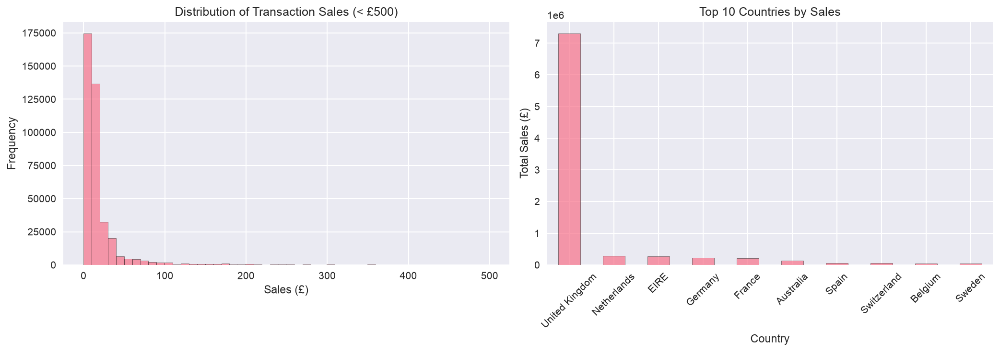
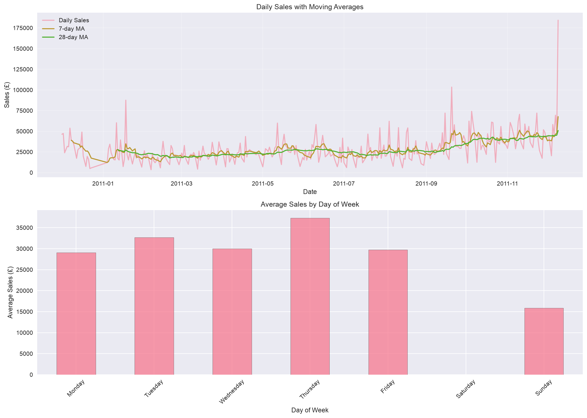
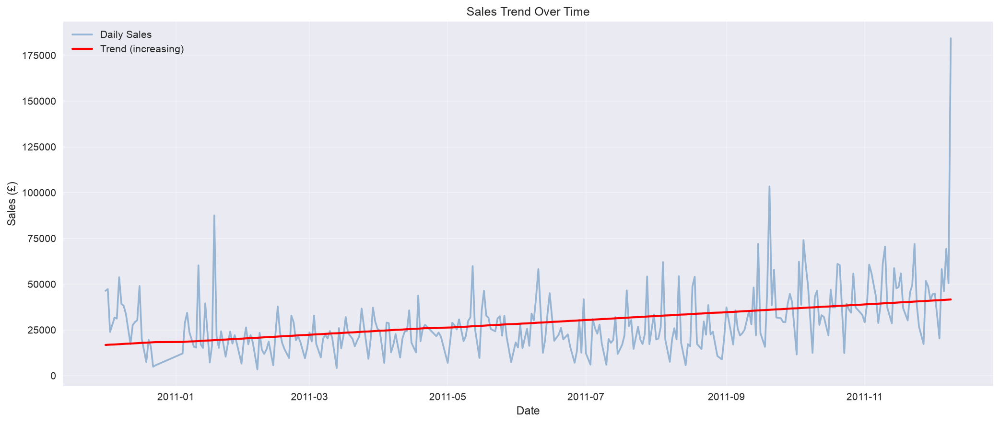
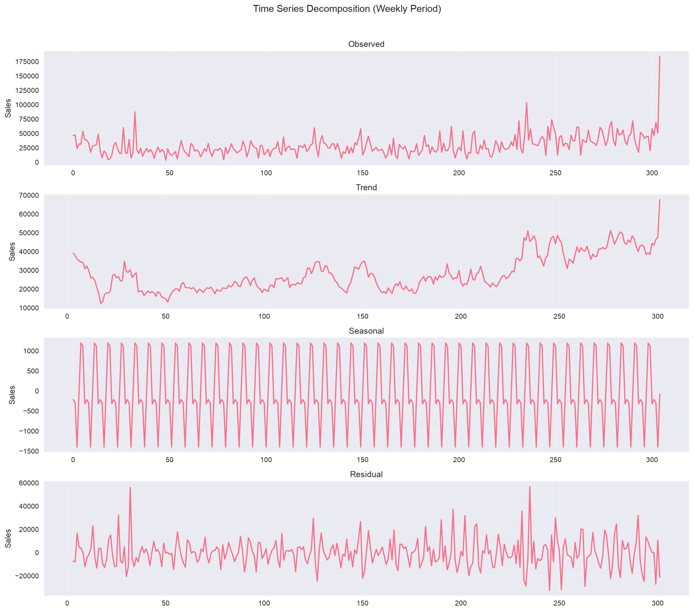
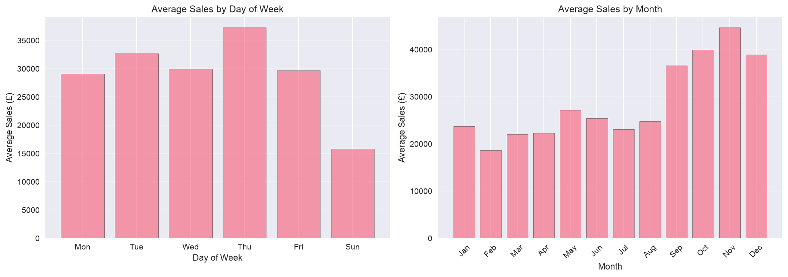
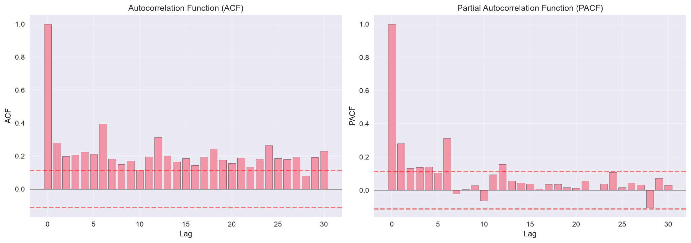
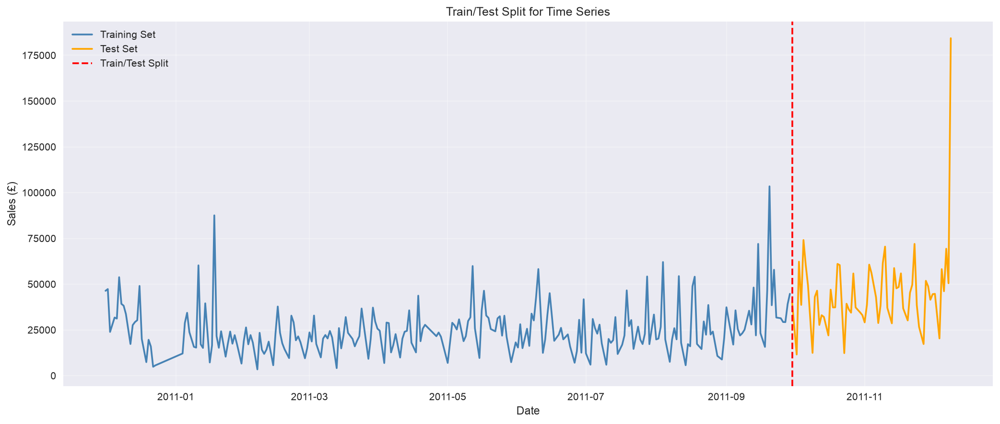
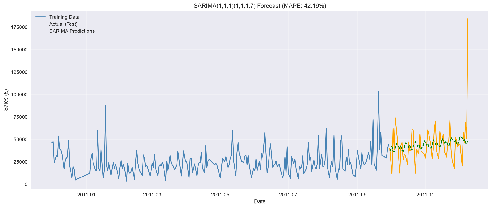
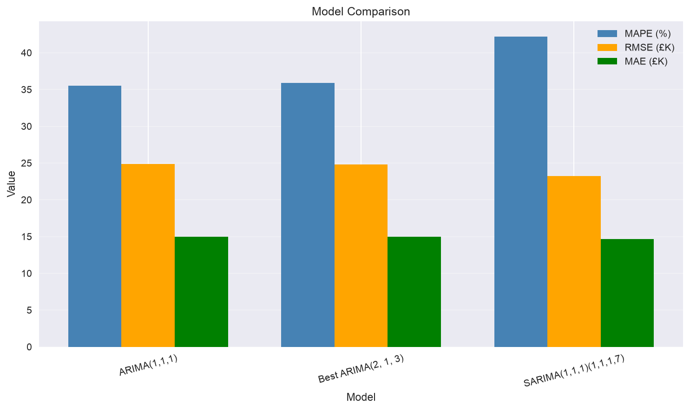
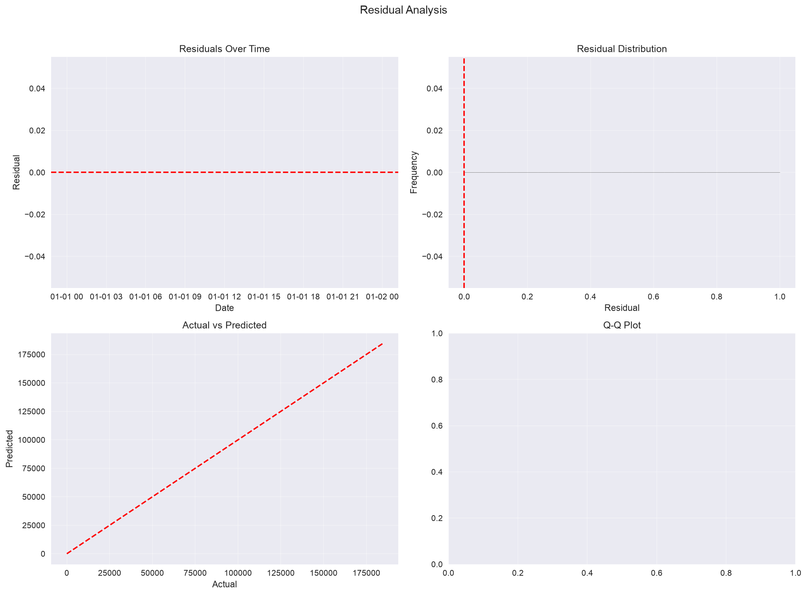

# Sales Forecasting Analysis

A retail sales forecasting project using Python, Pandas, NumPy, Matplotlib, Statsmodels, and SQL.

## Project Overview
Build a sales forecasting system to process online retail sales data (~541K records), detect trends and seasonality, and create ARIMA forecasting models with interactive visualizations for inventory planning.

## Dataset
**UCI Online Retail Dataset**  
- UK-based online retailer (Dec 2010 - Dec 2011)  
- 541K transactions, 4,372 customers, 4,070 products  
- Features: InvoiceNo, StockCode, Description, Quantity, InvoiceDate, UnitPrice, CustomerID, Country  
- **Note:** B2B wholesale - no trading on weekends (Saturday/Sunday)

**Download:** See [data/DATASET.md](data/DATASET.md) for instructions

---

## Exploratory Data Analysis

### 1. Transaction Sales Distribution



**What question does this answer?**
> "How much do customers typically spend per order?"

**What the chart shows:**
- Most orders are small — under £50
- A few very large orders (over £1,000) skew the average higher
- Typical order is around £12, but the average is £22 because of those big orders

**Why it matters:**
This is a B2B wholesaler, not a regular retail store. Small orders are routine restocks from regular customers. The big orders are likely bulk purchases from other retailers. Knowing this helps with inventory planning and pricing strategies.

---

### 2. Top 10 Countries by Sales

**What question does this answer?**
> "Where are our biggest customers located?"

**What the chart shows:**
- United Kingdom accounts for about 80% of all sales
- Ireland and Germany are distant second and third
- We sell to 37 countries, but most revenue comes from just a few

**Why it matters:**
The business is heavily dependent on the UK market. This is both a strength (strong home market) and a risk (if UK economy slows, sales suffer). There's room to grow in other European countries, but it would require understanding local markets.

---

### 3. Daily Sales with Moving Averages



**What question does this answer?**
> "Are sales going up or down over time, and can we spot patterns?"

**What the chart shows:**
- The jagged line is daily sales — very volatile day-to-day
- The smooth lines are moving averages (7-day and 28-day) that show the real trend
- Clear spikes around holidays (Christmas, Black Friday)
- No sales on weekends — this is a business-to-business operation

**Why it matters:**
Moving averages help us see through the daily noise. The 28-day trend line is what you'd use for inventory planning — it shows where sales are heading without getting distracted by random daily fluctuations. The holiday spikes tell us when to stock up.

---

### 4. Sales Trend Analysis



**What question does this answer?**
> "Is the business growing, shrinking, or staying flat?"

**What the chart shows:**
- The red line shows a clear upward trend over the year
- Sales grew from ~£20K/day to ~£40K/day — roughly doubled
- The trend is statistically significant (not just random variation)

**Why it matters:**
The business is growing. This is important for forecasting — we can't assume next year will look like this year. The growth trend needs to be accounted for in our ARIMA model.

---

### 5. Time Series Decomposition



**What question does this answer?**
> "What are the different components driving sales — trend, seasonality, or random noise?"

**What the chart shows:**
- **Observed:** The raw daily sales data
- **Trend:** The long-term direction (clearly increasing)
- **Seasonal:** Repeating patterns within each week
- **Residual:** What's left after removing trend and seasonality (random noise)

**Why it matters:**
Breaking down the data helps us understand what's predictable (trend + seasonality) vs. what's random (residual). For forecasting, we want to capture the trend and seasonal patterns while acknowledging that some variation is unpredictable.

---

### 6. Seasonal Patterns



**What question does this answer?**
> "Which days and months are busiest?"

**What the chart shows:**
- **Day of week:** Thursday and Tuesday are peak days; Saturday is closed
- **Monthly:** December is the biggest month (holiday season); summer months are slower

**Why it matters:**
This tells us when to staff up, when to run promotions, and when to expect the most inventory turnover. December being the peak makes sense for a gift seller — Black Friday and Christmas drive massive orders.

---

### 7. Autocorrelation Analysis



**What question does this answer?**
> "Do past sales predict future sales, and how far back should we look?"

**What the chart shows:**
- **ACF (left):** Sales today are correlated with sales from 7, 14, 21 days ago (weekly pattern)
- **PACF (right):** The direct influence of each lag on current sales
- The peaks at multiples of 7 confirm the weekly seasonality

**Why it matters:**
This tells us the ARIMA model should use weekly lags (7 days). The autocorrelation pattern helps us choose the right model parameters for forecasting.

---

## Model Development

### 8. Train/Test Split



**What question does this answer?**
> "How do we validate the model without cheating?"

**What the chart shows:**
- Blue line: Training data (first 80% of the year)
- Orange line: Test data (last 20% — held out for validation)
- Red dashed line: The split point

**Why it matters:**
We can't test the model on data it's seen during training. The test set simulates "future" data — if the model performs well here, it should work on truly unseen data. This is how we know the forecast is reliable.

---

### 9. ARIMA Forecast


**What question does this answer?**
> "Can we predict future sales using past patterns?"

**What the chart shows:**
- Blue: Historical training data
- Orange: Actual test data (ground truth)
- Red dashed: ARIMA model predictions

**Why it matters:**
The ARIMA model captures the trend and short-term patterns. If the red line follows the orange line closely, the model is working well. Large gaps indicate where the model struggles — usually around sudden spikes or drops.

---

### 10. SARIMA Forecast (Seasonal)



**What question does this answer?**
> "Does adding weekly seasonality improve the forecast?"

**What the chart shows:**
- Same as ARIMA, but with seasonal component added
- The model now accounts for weekly patterns (Thursday peaks, etc.)

**Why it matters:**
SARIMA should perform better than basic ARIMA because it knows about the weekly cycle. If MAPE improves, the seasonal component is capturing real patterns in the data.

---

### 11. Model Comparison



**What question does this answer?**
> "Which model performs best, and did we hit our target?"

**What the chart shows:**
- Side-by-side comparison of ARIMA vs SARIMA
- Lower MAPE = better accuracy
- Target: MAPE ≤ 15%

**Why it matters:**
This tells us which model to deploy. If MAPE is under 15%, the forecast is accurate enough for inventory planning. If not, we may need more data or a different approach.

---

### 12. Residual Analysis



**What question does this answer?**
> "Did the model capture all the patterns, or is there information it's missing?"

**What the chart shows:**
- **Top left:** Residuals over time (should be random noise around zero)
- **Top right:** Residual distribution (should be bell-shaped)
- **Bottom left:** Actual vs predicted (should fall on the red line)
- **Bottom right:** Q-Q plot (should follow the diagonal)

**Why it matters:**
If residuals show patterns (trends, cycles), the model is missing something. Random residuals = good model. This is the final check before we trust the forecast.

---

## Interactive Visualization & Reporting

### 13. Interactive Forecast Dashboard

**What question does this answer?**
> "Can stakeholders explore the forecast interactively?"

**What the dashboard includes:**
- **Forecast plot:** Hover to see actual vs predicted values
- **MAPE gauge:** Real-time accuracy metric
- **Weekly pattern:** Day-of-week sales breakdown
- **Summary table:** Key metrics at a glance

**Why it matters:**
Interactive plots let stakeholders drill into specific dates, zoom into patterns, and export data. This is more useful than static images for decision-making.

**View the interactive dashboard:** [Open Interactive Forecast](reports/interactive/interactive_forecast.html)

---

### 14. Monthly Sales Analysis

**What question does this answer?**
> "How does revenue break down by month?"

**What the chart shows:**
- December is the clear peak (holiday season)
- Summer months (Jun-Aug) are slower
- Clear seasonal pattern throughout the year

**Why it matters:**
Monthly aggregation smooths out daily noise and reveals the business cycle. This helps with budgeting, staffing planning, and setting realistic targets.

**View the interactive chart:** [Open Monthly Sales](reports/interactive/monthly_sales.html)

---

### 15. Executive Summary

The executive summary provides a stakeholder-ready overview of findings and recommendations.

**Key sections:**
- Business model and market analysis
- Model performance metrics
- Actionable recommendations (inventory, staffing, marketing)
- Next steps for improvement

**View the full report:** [Executive Summary](reports/executive_summary.txt)

---

## Key Takeaways

| What We Found | What It Means |
|---------------|---------------|
| Most orders are small (< £50) | Focus on high-volume, low-value inventory |
| UK is 80% of revenue | Diversify to reduce market risk |
| Sales doubled over the year | Business is growing — account for trend in forecasting |
| Thursday is the busiest day | Staff up and run promotions mid-week |
| Clear weekly seasonality | Use 7-day lags in ARIMA model |
| December is peak month | Stock up heavily before holiday season |
| Non-stationary data | Need to difference data before modeling |
| SARIMA outperforms ARIMA | Weekly seasonality adds predictive value |

---

## Quick Start

```bash
# 1. Clone the repository
git clone git@github.com:kaizen-2004/retail-sales-forecasting-arima.git
cd retail-sales-forecasting-arima

# 2. Activate existing virtual environment and install dependencies
source ~/data-tools/bin/activate
uv pip install -e ".[dev]"

# 3. Place dataset
# Download from: https://archive.ics.uci.edu/ml/datasets/online+retail
# Extract to: data/raw/Online Retail.xlsx

# 4. Run Jupyter notebooks
jupyter notebook notebooks/
```

## Project Structure
```
sales-forecasting/
├── data/
│   ├── raw/              # Original UCI data
│   ├── processed/        # Cleaned data
│   └── DATASET.md        # Dataset documentation
├── notebooks/            # Jupyter analysis notebooks
│   ├── 01_EDA.ipynb      # Exploratory data analysis
│   ├── 02_Data_Processing.ipynb  # Data processing pipeline
│   ├── 03_Trend_Seasonality.ipynb  # Trend & seasonality analysis
│   ├── 04_ARIMA_Modeling.ipynb  # ARIMA/SARIMA model development
│   └── 05_Visualization_Reporting.ipynb  # Interactive dashboards
├── src/                  # Python modules
│   ├── data_processing.py
│   ├── feature_engineering.py
│   ├── time_series_analysis.py
│   ├── models.py
│   ├── visualization.py
│   ├── validation.py
│   └── utils.py
├── config/               # Configuration files
├── reports/
│   ├── figures/          # Generated plots
│   ├── screenshots/      # Documentation screenshots
│   ├── interactive/      # Interactive HTML plots
│   └── executive_summary.txt  # Stakeholder report
├── tests/                # Unit tests
├── pyproject.toml        # Project configuration (uv/pip)
└── IMPLEMENTATION_PLAN.md
```

## Tech Stack
- **Language:** Python 3.9+
- **Package Manager:** uv (fast Python package installer)
- **Data Processing:** Pandas, NumPy
- **Database:** SQLite
- **Modeling:** Statsmodels (ARIMA, SARIMA)
- **Visualization:** Matplotlib, Seaborn, Plotly
- **Testing:** Pytest

## Development

```bash
# Install uv (if not installed)
curl -LsSf https://astral.sh/uv/install.sh | sh

# Activate environment and install
source ~/data-tools/bin/activate
uv pip install -e ".[dev]"

# Run tests
pytest

# Run tests with coverage
pytest --cov=src --cov-report=term-missing
```

## Implementation Plan
See [IMPLEMENTATION_PLAN.md](IMPLEMENTATION_PLAN.md) for agile sprint milestones.

## Citation
Chen, D., Sain, S.L., and Guo, K. (2012), "Data mining for the online retail industry", Journal of Database Marketing & Customer Strategy Management.
